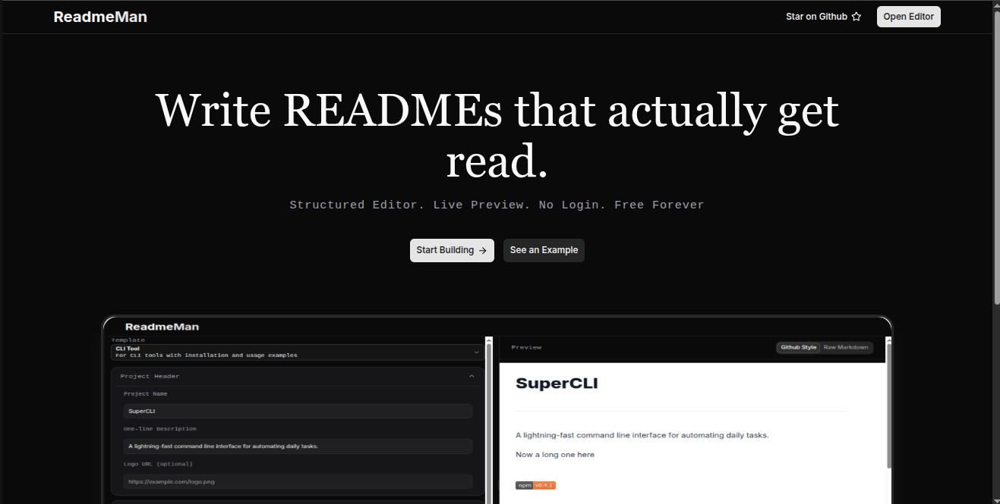

# ReadmeMan

---

A readme file generator.



This project allows you to generate to generate readme files through `form`. You select a template and then fill in the form then download or copy your readme file

<div align="center" class="flex flex-wrap">
     
</div>

## 🚀 Features

- Rich Markdown Display

- Readme Format Templates

- Real-time Update as you type

## 🛠 Tech Stack

- React

- React Router

- TailwindCSS

- Shadcn

## 📋 Prerequisites

Nodejs, Docker

## 📦 Installation

```bash
git clone repo && npm install
```

## 💻 Usage

```bash
git clone repo && npm install && npm run dev
```

## 🤝 Contributing

Contributions are welcome! Please open an issue or submit a PR.

## 📄 License

MIT
